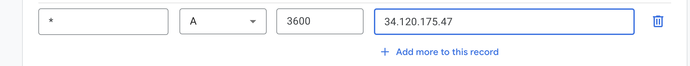

Exposing routes in Google Kubernetes Engine to my own domain name is something
I've done in the past, but these challenges are not only opportunities to try
new things, but a chance to practice things I already know, whether I have them
down pat or am starting to get rusty (as is the case here).

Luckily, since I'm kind of tired today, linking Google Kubernetes Engine to a
domain you control is not difficult at all. Three steps, really, if you want to
go the Ingress route, as I do (the alternative is to use Service resources, but
that's less flexible).

1. Create a static global IP
2. Configure your domain's DNS to point to this static IP
3. Create an ingress resource for your deployment

## Step by step

### 1. Create a static global IP address

Here's a couple of commands to take note of...


```console
$ gcloud compute addresses create textninja-ip --global
$ gcloud compute addresses describe textninja-ip --global 
```

There's not much to it other than this. It would be perfectly fine to use
click-ops, but I like using the command line for IP address reservations and
other operations with limited parameters.

However you go about doing it, the goal is to get a global IP address reserved.
Mine is shown below.


### 2. Configure your domain's DNS to point to the static IP

I'm not sure what subdomains I'll use in the future, so I decided to link the
reserved address to my domain via a wildcard record. Concretely, that meant
creating an "A" record for *.textninja.net, setting the data to the IP address I
just reserved. Using Google Domains, updating the DNS entry is very
straightforward. I just chose my domain from the list in the "My Domains"
section and clicked "DNS" to configure.



### 3. Create an ingress resource for your deployment

For this challenge, I created a new Docker image, [textninja/movingstripes](https://hub.docker.com/repository/docker/textninja/movingstripes). Next, I deployed it:

```yaml
apiVersion: apps/v1
kind: Deployment
metadata:
  name: movingstripes
  labels:
    app: movingstripes
spec:
  replicas: 3
  selector:
    matchLabels:
      app: movingstripes
  template:
    metadata:
      labels:
        app: movingstripes
    spec:
      containers:
        - name: movingstripes
          image: textninja/movingstripes:latest
          ports:
            - containerPort: 80
```

Next, it's necessary to create a service to connect to an ingress route. To keep
things as simple as possible, I used the default ClusterIP service type.

```yaml
apiVersion: v1
kind: Service
metadata:
  name: movingstripes
  labels:
    app: movingstripes
spec:
  selector:
    app: movingstripes
  ports:
    - port: 80
      targetPort: 80
```

By applying these two manifests to my cluster, I'm now able to access the
deployment with `kubectl port-forward svc/movingstripes 8080:80`. All that'sa
left is to create the ingress.

```yaml
apiVersion: networking.k8s.io/v1
kind: Ingress
metadata:
  name: movingstripes
  annotations:
    kubernetes.io/ingress.global-static-ip-name: textninja-ip
  labels:
    app: movingstripes
spec:
  rules:
    - host: dtc0003.textninja.net
      http:
        paths:
        - path: /
          pathType: Prefix
          backend:
            service:
              name: movingstripes
              port:
                number: 80
```

The pertinent parts are the host rule, which explicitly links this service to a
particular domain name, and the `kubernetes.io/ingress.global-static-ip-name`
annotation, which tells Kubernetes which static IP to use. Naturally, we're
using the IP address we provisioned earlier.


## Final result

I ended up with a funky rotating cube deployed to http://dtc0003.textninja.net.
I then promptly deleted it, because why would I pay for that. The repo, as
always, [is available](https://github.com/textninja/dtc0003).


Some other day, I'll have to walk through the set up of TLS on GKE using
LetsEncrypt.


## Tech used

For the deployment:

 - Google Cloud Platform
 - Kubernetes / Kustomize
 - Google Domains (DNS)
 - Docker

For the silly spinning cube:

 - Vite
 - THREE.js
 - Greensock
 - Sass

## Future challenge ideas

Today, for reasons unknown, I came up with the following ideas for future
tech challenges.

 - Build twilio call answering bot with dial pad menu
 - Configure istio
 - Write implementation of Djikstra's pathfinding algorithm
 - Use terraform with GKE
 - Create GKE cluster with self-destruct capability
 - Use ansible with Kubernetes
 - Create a pretty Venn diagram using d3
 - Configure Google Kubernetes Engine with custom domain to use TLS

This time tomorrow, though, I'll work on getting a themed Jekyll blog up and
running.
